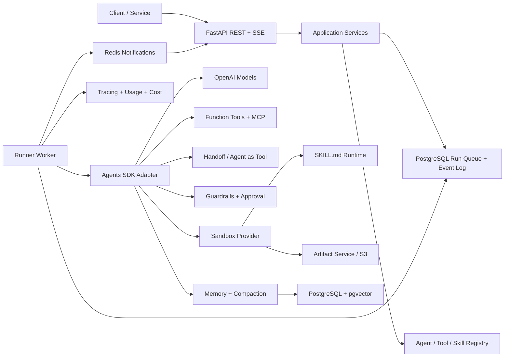
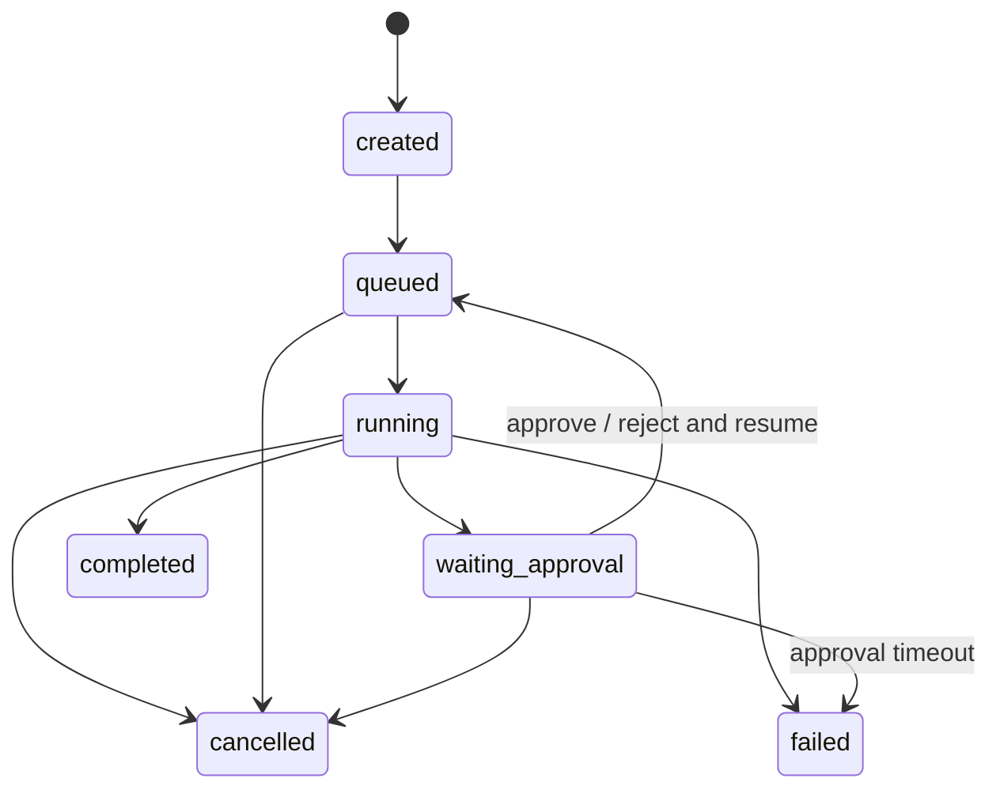
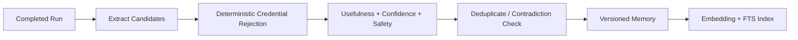

# Agent 系统总体实现方案

> 文档类型：现行架构规范
> 状态：现行；描述当前实现及仍保留的生产目标
> 最后核对：2026-08-26
> 适用版本：AgentSDK `0.1.0`、`openai-agents==0.22.0`、数据库迁移 `0006`

> 本文描述当前主要架构合同。尚未完成的生产故障验证和明确接受的边界以
> [架构复核记录](05-review-decisions-and-backlog.md) 为准；精确 API 以运行时
> `/openapi.json` 为准。

## 1. 设计目标

系统以 OpenAI Agents SDK 为运行内核，对外提供稳定、可持久化的 Agent 平台接口。设计重点是：

- 一个 Run 可以跨进程、跨审批等待和服务重启继续执行。
- Agent、技能、工具和输出契约全部版本化，历史 Run 可复现其配置。
- 实时事件与最终状态一致，SSE 断线后可重放。
- 长期经验记忆与 Session 历史分离，经过治理后才进入后续 Context。
- Sandbox、Skills、Memory、Compaction 等易变化能力不泄漏到 API 和领域层。
- 每次模型调用、工具调用、Artifact 和记忆写入均有 Trace、用量与审计线索。

## 2. 技术选型

| 类别 | 选择 | 用途与理由 |
|---|---|---|
| 语言 | Python 3.12 | 与 OpenAI Agents SDK Python 版、Pydantic、FastAPI 生态一致 |
| API | FastAPI + Uvicorn | REST、SSE、类型化请求/响应、OpenAPI |
| Agent Runtime | `openai-agents==0.22.0` | Agent loop、Tools、MCP、Guardrails、Handoffs、Streaming、Tracing；最终以 lockfile 和合同测试结果为准 |
| Schema | Pydantic v2 + JSON Schema | 内部类型和对外结构化输出契约 |
| 数据库 | PostgreSQL 16 | 业务状态、事件日志、审计和可靠运行队列的事实来源 |
| ORM/迁移 | SQLAlchemy 2 async + asyncpg + Alembic | 异步访问、Repository 和可重复迁移 |
| 向量检索 | pgvector + PostgreSQL FTS | 长期记忆的混合检索，减少额外基础设施 |
| 实时协调 | Redis 7 | SSE 通知/扇出、分布式互斥、限流和短期缓存 |
| Artifact | S3/MinIO + 本地适配器 | 大对象、校验和、保留、开发/生产一致接口 |
| Sandbox | Docker Provider + Local Dev Provider | 生产隔离与本地开发效率；统一接口可替换为远程 Sandbox |
| 可观测性 | SDK Tracing + OpenTelemetry | Agent 语义 Trace 与平台指标/日志关联 |
| 测试 | pytest、pytest-asyncio、Testcontainers | 单元、集成、迁移、崩溃恢复和端到端测试 |

不使用“最新版”或无上限依赖。2026-08-09 的初始调研基线选择 Python `v0.19.4`，2026-08-26 完成到 `v0.22.0` 的受控升级；当前 `pyproject.toml` 和 `uv.lock` 均精确固定 `openai-agents==0.22.0`，并在 `runs.sdk_version` 保存实际运行版本。上游升级必须先通过相同合同测试，不因文档中的历史版本快照自动升级。

## 3. 总体架构



### 3.1 控制面

负责 Agent、Tool、MCP Server、Skill、Guardrail 和输出 Schema 的注册、版本、发布与校验。控制面只保存声明和绑定，不保存 Python 可执行代码正文；代码实现由部署时的依赖注入 Registry 根据稳定 `implementation_key` 解析。

### 3.2 运行面

Runner Worker 从 PostgreSQL 以 `FOR UPDATE SKIP LOCKED` 领取 Run，设置带过期时间的执行租约。运行面装配指定的 Agent Version，调用 SDK，持久化事件和状态，并在审批、取消、失败或完成时安全结束本次 Worker 占用。

### 3.3 执行面

Function Tools、MCP 和 Sandbox 都经过统一执行策略：参数校验、权限判断、审批、超时、重试、结果大小限制、Artifact 提取、审计和 Trace。

### 3.4 状态面

PostgreSQL 保存事实状态；Redis 只发送“某 Run 有新事件”的通知。即使 Redis 消息丢失，SSE 仍可从数据库按序号补读，因此不会丢业务事件。

## 4. 当前代码结构

```text
AgentSDK/
├── README.md
├── docs/                         # 规范、设计、运维、决策和验收快照
├── pyproject.toml
├── uv.lock
├── alembic.ini
├── migrations/versions/          # 0001 至当前 0006
├── scripts/                       # Provider、Sandbox、长 Context 验证与文档检查
├── src/agent_system/
│   ├── api.py                    # FastAPI、REST、SSE 与错误合同
│   ├── config.py                 # 环境配置和生产约束
│   ├── container.py              # 服务装配和依赖注入
│   ├── db.py / models.py         # SQLAlchemy、事务和持久化模型
│   ├── schemas.py                # 公共 REST 请求模型
│   ├── agent_definitions.py      # AGENT.md、全局默认和平台策略编译
│   ├── registry.py               # Agent/Tool/MCP/Skill 注册与版本发布
│   ├── agent_factory.py          # Agent Version 到 Agents SDK 对象装配
│   ├── providers.py              # Provider、模型目录、协议和能力适配
│   ├── runner.py / worker.py     # 持久化运行服务、领取、恢复和执行
│   ├── sessions.py               # Canonical Transcript 和 Chat 视图
│   ├── compaction.py             # Active Projection 和压缩流水线
│   ├── memory.py                 # 长期经验记忆候选、检索和治理
│   ├── tools.py                  # Function Tool 运行适配
│   ├── tool_executions.py        # 副作用幂等账本和对账
│   ├── sandbox.py / skills.py    # Local/Docker Sandbox 与 SKILL.md
│   ├── artifacts.py              # 本地/S3 Artifact 生命周期
│   ├── events.py / costs.py      # Transactional Outbox、Usage 和 Cost
│   └── crypto.py / serialization.py
└── tests/                         # 按服务能力组织的合同和集成测试
```

当前实现采用单 Python package、按服务模块分文件，而不是早期设想的多层目录。`Container` 负责装配，API 和 Worker 只调用服务；Provider、Sandbox、Artifact、通知和模型运行均通过明确服务边界隔离。后续只有在模块规模或独立部署边界确实需要时才拆分 package，文档不得提前描述不存在的目录。

## 5. 核心领域模型

所有主键使用 UUIDv7；时间统一保存 UTC；用户可见资源默认包含 `tenant_id`、`created_at`、`updated_at`。第一版不实现完整多租户鉴权，但避免未来进行破坏性表结构迁移。

| 实体 | 关键字段 | 说明 |
|---|---|---|
| `agents` | `id`, `slug`, `name`, `status` | Agent 逻辑身份，不包含可变运行配置 |
| `agent_versions` | `agent_id`, `version`, `definition_*`, `overrides_json`, `config_json`, `config_hash`, `status` | 角色源文档、显式覆盖和不可变有效配置；发布后禁止修改 |
| `agent_settings` | `global_instructions`, `defaults_json`, `policy_json`, `*_revision` | 全局默认和当前平台强制策略 |
| `agent_bindings` | `agent_version_id`, `kind`, `target_id`, `position`, `config_json` | 工具、技能、Handoff、Guardrail 等绑定 |
| `runs` | `agent_version_id`, `session_id`, `status`, `lease_*`, `limits_json`, `sdk_version` | 顶层运行与状态机 |
| `run_states` | `run_id`, `format_version`, `encrypted_state`, `sdk_version` | SDK 暂停/恢复状态；加密且版本化 |
| `run_events` | `run_id`, `seq`, `type`, `payload_json`, `published_at`, `publish_*` | SSE、审计与 Redis 通知的 Transactional Outbox |
| `sessions` | `id`, `scope`, `status`, `last_item_seq`, `revision`, `active_projection_revision` | 对话容器与投影 CAS |
| `session_items` | `session_id`, `seq`, `item_json`, `active` | Canonical Transcript；压缩不修改 |
| `approvals` | `run_id`, `tool_call_id`, `status`, `request_json`, `decision_*` | 人工审批与幂等决定 |
| `tools` | `id`, `kind`, `implementation_key`, `schema_json`, `policy_json` | Function、MCP 或 Agent Tool 声明 |
| `mcp_servers` | `id`, `transport`, `endpoint_config`, `secret_refs`, `policy_json` | 不保存明文密钥 |
| `skills` | `id`, `slug`, `status` | 技能逻辑身份 |
| `skill_versions` | `skill_id`, `version`, `content_hash`, `manifest_json`, `bundle_uri` | 不可变技能包 |
| `memories` | `scope_*`, `kind`, `content`, `embedding`, `confidence`, `validity_*` | 经过治理的长期记忆 |
| `memory_sources` | `memory_id`, `run_id`, `message_ids`, `artifact_ids` | 记忆血缘 |
| `memory_candidates` | `run_id`, `content`, `status`, `scores_json` | 未进入正式记忆前的候选区 |
| `compactions` | `session_id`, `source_*`, `strategy`, `summary_json`, `validation_json`, `metrics_json` | 压缩 Attempt、审计和恢复点 |
| `context_projections` | `session_id`, `revision`, `source_*`, `strategy`, `checksum` | 模型可见窗口的活动版本 |
| `context_projection_segments` | `projection_id`, `position`, `segment_type`, `item_json` | Checkpoint、原文、Artifact 和 Control 分段 |
| `compaction_leases/state/source_chunks` | `session_id/compaction_id`, `attempt_id`, `status`, `source_range` | 单写租约、防抖状态与分块进度 |
| `artifacts` | `storage_key`, `sha256`, `mime`, `size`, `run_id`, `lineage_json` | 对象存储元数据 |
| `usage_records` | `run_id`, `span_id`, `model`, `usage_json` | SDK 原始用量事实 |
| `cost_records` | `usage_record_id`, `price_version`, `amount`, `currency` | 按当时价格计算的不可变成本 |
| `audit_logs` | `actor_id`, `action`, `resource_*`, `before_json`, `after_json` | 管理动作审计 |

关键数据库约束：

- `agent_versions(agent_id, version)`、`run_events(run_id, seq)`、`messages(session_id, seq)` 唯一。
- 一个 Run 同时只能有一个有效执行租约。
- 一个 Tool Call 只能存在一个有效 Approval；审批决定采用 compare-and-swap。
- Artifact 的 `sha256 + size` 可用于去重，但权限和血缘不合并。
- 正式 Memory 必须至少有一个 `memory_source`，人工创建的记忆以审计记录作为来源。

## 6. Agent 定义、注册和装配

### 6.1 角色文档与 Agent Version

Agent 使用类似 `CLAUDE.md` 的 `AGENT.md` 角色文档：YAML Frontmatter 保存身份、路由描述和少量显式覆盖，Markdown 正文保存角色特有 Instructions。Provider、默认模型、Runtime、Compaction、Memory、Sandbox、审批和 Tracing 由 `agent_settings` 提供全局默认。

编译优先级为“平台强制策略 > 角色覆盖 > 全局默认”，Instructions 为“全局 Instructions + 角色正文”。编译器严格拒绝未知字段，解析绑定资源与 Provider 模型，注入 Context 能力，并把源文档、显式覆盖、有效配置、配置哈希和设置 revision 固化进不可变 AgentVersion。全局默认改变不影响已发布版本；当前平台策略在每个 Run 开始时重新限制历史版本。

`AgentFactory` 在每个 Run 开始时读取有效配置快照，将 `implementation_key` 解析为已部署代码并构造 SDK `Agent`。完整格式和 API 见 [Agent 角色定义、全局默认与平台策略](11-agent-role-definitions.md)。

### 6.2 发布校验

- 所有绑定资源存在且为可用版本。
- Instructions 模板变量完整且没有未知变量。
- 输出 Schema 可被 SDK 和平台验证器接受。
- Handoff 图满足环路、深度和权限策略。
- Tool/MCP/Skill 的危险能力均有明确审批或禁止策略。
- Sandbox 资源上限不超过平台上限。

## 7. Runner 与持久化状态机



### 7.1 执行流程

1. `POST /v1/runs` 在一个事务中写入 Run、初始输入和 `run.created`，返回 `202`。
2. Worker 领取 `queued` Run，写入租约、`run.started` 并提交事务。
3. `AgentFactory` 装配 Agent；Context Service 加载 Session、检索长期记忆并判断是否压缩。
4. Runner 调用 SDK 流式接口；`EventBridge` 把 SDK 事件转换为平台事件。
5. 领域状态和对应 `run_events` 在同一事务提交；Dispatcher 再发布 Redis 通知，失败由 Outbox 租约和退避字段重试。
6. 遇到审批中断时，将 SDK 可恢复状态编码、加密、落库，Run 改为 `waiting_approval` 并释放租约。
7. 审批 API 以事务写决定，将 Run 改回 `queued`；任意 Worker 可读取状态继续执行。
8. 完成时同时写最终输出、用量、Artifact 引用和 `run.completed`；随后异步产生记忆候选和合并任务。

### 7.2 崩溃恢复和幂等

- Worker 每隔固定时间续租；租约过期的 `running` Run 由 Reaper 重排队。
- Function Tool 使用 `tool_executions` 账本领取执行权，接收稳定 `tool_call_id`/幂等键；完成结果可重放，结果不确定时进入 `unknown` 并禁止自动重试。
- 端到端 exactly-once 要求下游 API 同样接受该幂等键；MCP 当前缺少 SDK Call ID 透传，有副作用时必须由 MCP Server 自己实现业务幂等。
- `run_states` 保存 `format_version`、`sdk_version` 和校验和；不兼容版本不得静默恢复。
- Run 状态更新使用乐观版本号，防止取消、审批和 Worker 完成相互覆盖。

## 8. Session、Context 和 Compaction

### 8.1 三类上下文严格分离

- **Application Context**：数据库连接、当前 Actor、租户、密钥解析器、服务对象；只供代码使用。
- **Conversation Context**：Session 消息、压缩摘要、当前输入和工具交互；模型可见。
- **Retrieved Memory**：按当前任务检索出的长期记忆；以带来源/可信度的独立区块注入。

Context Builder 的优先级为：系统规则 > 当前用户输入 > 未决工具/审批状态 > 最近消息 > 已确认长期记忆 > 历史摘要。历史记忆与当前输入冲突时，不覆盖当前输入，并产生冲突事件供后续记忆修正。

### 8.2 Compaction 策略

- 按显式 Context Window、Tokenizer、静态/输出/Tool Loop/Safety 预算计算高低水位；真实 Provider Usage 是后验事实。
- Provider Capability 合同确认 Native Compact 和 Replay 都可用时保存 canonical Compaction Item；否则生成 Portable Structured Checkpoint。
- 必保留 System/Developer、最近 Token 尾部、当前任务、未决 Tool/Approval、Artifact/文件/URL/Commit/Run 等精确引用。
- 压缩只原子切换 Active Projection；Canonical Transcript 不重写、不插入伪摘要、不因压缩设为 inactive。
- Session Lease、Snapshot Checksum 和 Projection Revision CAS 阻止并发双激活；Snapshot 后的新消息作为 Tail 续接。
- Schema、原子关系、Identifier、Token、Chunk Coverage 任一校验失败都执行 Hard No-op。
- 长期记忆不在压缩时 Flush；Retrieval 只在下一次 Model Call 前作为 Request-only Segment 注入。

## 9. 长期经验记忆

### 9.1 记忆类型

- `semantic`：用户偏好、稳定事实、项目约束。
- `episodic`：一次运行中可复用的结果和上下文。
- `procedural`：工具选择、排错路径、成功/失败经验。

Session 历史不会自动成为长期记忆。只有 `memory_candidate` 经治理后才能进入 `memories`。

### 9.2 写入管线



- 默认不记忆密钥、认证信息、原始 Guardrail 拒绝内容和未经许可的第三方敏感信息。
- 低可信候选留在候选区或过期，不进入模型 Context。
- 合并不会原地抹除历史：创建新修订并把旧记忆标记为 superseded。
- 记忆具有 `valid_from`、`valid_to`、`last_confirmed_at` 和可配置 TTL。

### 9.3 检索与注入

使用 pgvector 相似度、PostgreSQL 全文检索、时间衰减、作用域匹配和可信度进行混合排名。检索结果采用 RRF 或归一化加权合并，去重后限制 Token 预算。注入文本明确标记为“历史记忆，可能过期”，并附内部 Memory ID 便于 Trace 和纠错。

SandboxAgent Memory 若启用，只作为 `MemoryProvider` 的一种运行时实现或同步目标；平台数据库仍是跨 Session 长期经验记忆的事实来源。

## 10. `SKILL.md` 技能系统

### 10.1 技能包约定

```text
.agents/skills/<skill-slug>/
├── SKILL.md
├── scripts/
├── references/
└── assets/
```

`SKILL.md` 的 Front Matter 至少声明 `name`、`description` 和平台 `compatibility`；可扩展声明运行依赖、所需工具、网络域名、Secret 名称和 Sandbox 资源要求。

### 10.2 生命周期

1. Importer 扫描目录，阻止符号链接/路径逃逸，解析 Front Matter。
2. Validator 检查名称、引用、文件大小、依赖、脚本类型和权限声明。
3. Scanner 对脚本和二进制资源进行安全检查，生成清单和 SHA-256。
4. Publisher 上传不可变 bundle，创建 `SkillVersion`。
5. Agent 发布时绑定明确 Skill Version。
6. Run 启动时只把绑定技能物化到 Sandbox；模型先看到元数据，需要时再读取正文和资源。

任何 Skill 脚本都不能绕过 Tool/Sandbox 的网络、审批和资源策略。技能是指导和资源包，不是新的权限边界。

## 11. Function Tools 与 MCP

### 11.1 统一执行包络

每次调用经过以下链路：

`Schema Validation -> Authorization Policy -> Guardrail -> Approval -> Execute -> Output Validation -> Artifact Extraction -> Trace/Usage -> Event`

工具策略至少包括：

- `timeout_seconds`、`max_attempts`、退避策略。
- `max_input_bytes`、`max_output_bytes`。
- `approval_mode`: `never | always | policy`。
- `side_effect`: `none | reversible | irreversible`。
- `concurrency_key` 和最大并发。
- 允许的 Secret 引用、网络目的地和 Sandbox 文件范围。

### 11.2 MCP

- MCP 配置只保存 Secret 引用，不保存明文令牌。
- 工具发现结果带 TTL 缓存，但 Agent Version 仍保存发布时允许的 Tool 名单。
- 调用时对实际发现结果与允许列表取交集，避免 MCP Server 新增工具后自动扩大权限。
- 连接、列举工具和实际调用分别记录 Span；返回内容同样经过大小、类型和安全校验。

## 12. Guardrails 与人工审批

Guardrail 结果统一为 `allow`、`block`、`require_approval`、`transform`。本版本不提供启发式通用脱敏；未来的 `transform` 只允许处理 Tool Schema 明确声明的敏感路径或确定性的格式修正。

审批请求包含：Agent、Run、Tool、参数、风险等级、预计副作用、请求时间和过期时间。当前参数可能是原始值；未来只有 Tool Schema 明确声明的敏感路径才做确定性遮盖。审批人可 `approve` 或 `reject`，并填写理由；不允许在审批时悄悄修改工具参数。如需修改参数，应驳回后由 Agent 产生新的 Tool Call。

SDK 的中断/恢复对象通过 `StateCodec` 保存，REST 层只暴露平台 Approval ID，不暴露 SDK 内部序列化格式。

## 13. 结构化输出

- 代码内 Agent 可以直接绑定 Pydantic 类型。
- 配置化 Agent 使用版本化 JSON Schema，由 `OutputSchemaRegistry` 解析和校验。
- `AgentFactory` 将 Schema 转为 SDK 可接受的输出声明；完成后 API Boundary 再使用原始 Schema 校验一次。
- 数据库同时保存原始输出和已验证输出；只有后者对调用方标记为 `succeeded`。
- 修复重试受独立上限控制，并计入用量和成本。

## 14. Sandbox 和 Artifact

### 14.1 SandboxProvider 接口

```python
class SandboxProvider(Protocol):
    async def create(self, spec: SandboxSpec) -> SandboxHandle: ...
    async def exec(
        self,
        handle: SandboxHandle,
        command: list[str],
        cwd: str = ".",
        timeout: int | None = None,
    ) -> ExecResult: ...
    async def destroy(self, handle: SandboxHandle) -> None: ...
```

当前接口只承诺创建、执行和销毁，不声称支持 Sandbox 快照或恢复。生产 Docker Provider 使用只读基础镜像、非 root 用户、工作目录挂载、默认禁网、CPU/内存/PID/时限和 `no-new-privileges`；`network_enabled=true` 表示使用 Docker 默认网络，尚未实现目标域名允许列表。Local Provider 只允许非生产环境。

### 14.2 Artifact 生命周期

Artifact Service 先计算 SHA-256、MIME 和规范化文件名，再写入最终对象 key，随后提交数据库元数据；数据库提交失败会补偿删除对象。Local Store 通过临时文件和原子替换避免半文件，S3 直接写对象。读取时重新校验 SHA-256。

S3 Key 不直接对客户端公开；当前下载由 API 读取对象后流式返回，尚未提供短期签名 URL。删除先把记录标为 `deleting`，删除对象后标为 `deleted`；带 `expires_at` 的活动对象可由清理任务回收。

## 15. REST API

### 15.1 主要资源

完整 API 清单、参数和 Schema 以运行时 `/openapi.json` 为准，交互式页面位于 `/docs`。下列只列业务接入的主要工作流：

```text
GET    /v1/provider-definitions
POST   /v1/provider-connections
POST   /v1/provider-connections/{id}/validate
GET    /v1/provider-connections/{id}/models

GET    /v1/agent-settings
PUT    /v1/agent-settings
POST   /v1/agent-definitions/validate
POST   /v1/agents/from-definition
POST   /v1/agents/{agent_id}/versions/from-definition
GET    /v1/agents/{agent_id}/versions/{version}/definition

POST   /v1/agents
GET    /v1/agents
GET    /v1/agents/{agent_id}
POST   /v1/agents/{agent_id}/versions
GET    /v1/agents/{agent_id}/versions
POST   /v1/agents/{agent_id}/versions/{version}/publish

POST   /v1/runs
GET    /v1/runs/{run_id}
POST   /v1/runs/{run_id}/cancel
GET    /v1/runs/{run_id}/events
GET    /v1/runs/{run_id}/stream

POST   /v1/sessions
GET    /v1/sessions
GET    /v1/sessions/{session_id}
GET    /v1/sessions/{session_id}/messages
GET    /v1/sessions/{session_id}/chat-messages
POST   /v1/sessions/{session_id}/compact
GET    /v1/sessions/{session_id}/compactions
POST   /v1/sessions/{session_id}/compactions/{id}/restore
GET    /v1/sessions/{session_id}/context-preview

GET    /v1/approvals
GET    /v1/approvals/{approval_id}
POST   /v1/approvals/{approval_id}/approve
POST   /v1/approvals/{approval_id}/reject

POST   /v1/tools
GET    /v1/tools
POST   /v1/mcp-servers
GET    /v1/mcp-servers
POST   /v1/skills/import
GET    /v1/skills
GET    /v1/skills/{skill_id}/versions

POST   /v1/memories
GET    /v1/memories
PATCH  /v1/memories/{memory_id}
DELETE /v1/memories/{memory_id}

POST   /v1/artifacts
GET    /v1/artifacts/{artifact_id}
GET    /v1/artifacts/{artifact_id}/download
DELETE /v1/artifacts/{artifact_id}

POST   /v1/prices
GET    /v1/usage
GET    /v1/costs
```

`POST /v1/runs` 默认返回 `202 Accepted`。需要流式结果的客户端随后连接 `/stream`；短任务也不提供另一套同步状态语义，从而避免两套执行路径。

### 15.2 统一错误结构

```json
{
  "error": {
    "code": "approval_conflict",
    "message": "Approval has already been decided",
    "request_id": "uuid",
    "details": {}
  }
}
```

错误消息不能包含 Prompt、Secret、完整工具参数或 SDK State。

## 16. SSE 事件协议

每个事件具有单调递增 `seq`，SSE `id` 使用该值：

```text
id: 42
event: tool.completed
data: {"schema_version":1,"run_id":"...","seq":42,"time":"...","data":{...}}
```

首版事件类型：

- `run.created`、`run.started`、`run.completed`、`run.failed`、`run.cancelled`
- `agent.started`、`agent.completed`、`handoff.started`、`handoff.completed`
- `model.output_delta`、`model.completed`
- `tool.called`、`tool.completed`、`tool.failed`
- `approval.required`、`approval.resolved`
- `artifact.created`
- `memory.candidate_created`、`memory.updated`
- `context.compacted`
- `usage.updated`

连接流程：先按 `Last-Event-ID` 从 PostgreSQL 补齐，再订阅 Redis 通知；收到通知后仍从数据库读取。每 15 秒发送注释心跳。事件 Payload 有大小上限，大内容使用 Artifact 引用。

## 17. Tracing、用量和成本控制

- API 请求生成 `request_id`，Run 生成或关联 `trace_id`；SDK Trace、OpenTelemetry Trace 和数据库 Run 相互引用。
- Tool、MCP、Sandbox、Handoff、Compaction 和 Memory Consolidation 都创建子 Span。
- 用量保存 SDK 返回的原始维度，不因当前计价逻辑缺少某个维度而丢弃。
- 价格表是带生效区间的配置数据；`cost_record` 固化价格版本、计算公式和金额。

基础控制项：

- Run 的最大轮数、最大持续时间、最大 Tool Call 数和最大输出 Token。
- Agent、Actor、Tenant 的并发上限。
- 单 Run 成本上限和日预算；启动时检查预算，在每次可控的下一次模型调用前重新检查。
- 达到软阈值产生事件；达到硬阈值停止后续调用并以明确原因结束。

已经发生的单次模型调用无法在返回用量前精确硬切成本，因此“硬限额”定义为阻止下一次调用，并结合模型最大输出 Token 降低单次超额风险。

## 18. 安全基线

- Provider Secret 可引用环境变量，或由 ProviderConnection 使用平台密钥派生的独立 Fernet 密钥加密保存；AgentVersion 只保存连接和模型 ID。MCP Secret 仍使用环境变量引用。本版本不声称日志、事件和审批参数具备通用自动脱敏。
- 所有外部输入经过 Schema、长度和 MIME 校验。
- MCP、Skill 和长期记忆都视为不可信输入，不能提升系统/开发者指令权限。
- Memory 写入前进行 Prompt Injection、敏感信息和来源策略检查。
- Sandbox 默认拒绝网络和宿主文件访问，导出采用显式允许路径。
- Run State 使用应用层信封加密；只允许相同应用和兼容 SDK 版本解码。
- Artifact 下载、审批和管理 API 均保留 Actor 审计钩子；接入公网前必须配置认证适配器。

## 19. 测试方案

### 19.1 单元测试

- 领域状态机、发布校验、成本计算、记忆排名、Compaction 保留规则。
- AgentFactory、Tool Policy、Skill Parser、StateCodec 和事件映射。

### 19.2 Contract 测试

- 固定版本 Agents SDK 的 Agent、Streaming、HITL State、Session、MCP、Tracing 和 Sandbox Adapter 合同。
- SDK 升级时先运行该测试集，不通过则禁止更新 lockfile。

### 19.3 集成测试

- 使用 Testcontainers 启动 PostgreSQL/pgvector、Redis、MinIO 和 Docker Sandbox。
- 验证迁移、租约接管、SSE 重放、Artifact 提交/清理、MCP 超时和网络策略。

### 19.4 端到端测试

使用可控的 Fake Model 覆盖确定性流程，另设显式标记的 OpenAI Live Tests：

1. 注册并发布带 Tool、MCP、Skill、Guardrail、输出 Schema 和子 Agent 的 Agent。
2. 创建 Session 和 Run，连接 SSE。
3. 检索历史记忆并在接近阈值时压缩 Context。
4. Function Tool 产生审批；停止原 Worker，审批后由新 Worker 恢复。
5. 子 Agent 在 Sandbox 中使用 Skill，生成 Artifact。
6. 最终输出通过 Schema，Trace、用量、成本和事件齐全。
7. Run 后提炼长期经验；下一 Run 能检索到该经验。
8. 验证取消、超时、崩溃、重复请求和断线续传路径。

## 20. 实现依赖顺序

以下是一次性交付内部的开发依赖顺序，不是产品阶段：

1. 工程骨架、配置、领域模型、数据库和迁移。
2. Agent/Tool/MCP/Skill 注册表、版本和 `AgentFactory`。
3. Runner Worker、租约、状态机、事件日志和 SDK Adapter。
4. Session、Context Builder、Streaming Event Bridge 和 REST/SSE。
5. Function Tools、MCP、结构化输出和统一执行策略。
6. Guardrails、审批持久化和跨进程恢复。
7. Handoff、Agent as Tool 与编排限制。
8. Sandbox Provider、Skill 物化和 Artifact 管理。
9. 长期经验记忆、混合检索和 Context Compaction。
10. Tracing、用量账本、价格表和基础成本控制。
11. 安全加固、故障注入、完整集成和端到端验收。

在完成所有 15 项的端到端主链路之前，不把任何中间节点定义为本项目完成。

## 21. 生产完成定义（尚未全部满足）

以下条件用于判定“经过完整生产故障验证”，当前工程实现尚未全部满足：

- 15 项功能的验收标准全部有自动化测试，且主链路端到端通过。
- 服务重启、Worker 崩溃、Redis 短时不可用和 SSE 断线不会造成状态丢失。
- 审批恢复、Sandbox 清理、长期记忆复用和 Context Compaction 均在真实持久化环境验证。
- OpenAPI、数据库迁移、部署配置、示例 Agent/Skill/MCP 和运维说明齐全。
- 依赖锁定、SDK Contract 测试、基础安全扫描和成本上限测试通过。

## 22. 主要风险与处理

| 风险 | 处理方式 |
|---|---|
| SDK Beta 能力变化 | Adapter 隔离、精确锁版本、Contract 测试、状态格式版本化 |
| 审批状态无法跨版本恢复 | 保存 SDK 版本；升级前完成旧状态迁移或清空未决 Run 窗口 |
| SSE 通知丢失 | PostgreSQL 事件日志为事实来源，Redis 只做通知 |
| 长期记忆污染/投毒 | 候选区、来源血缘、Guardrail、可信度、人工纠错和过期机制 |
| MCP/Skill 扩权 | 工具允许列表、版本绑定、Sandbox、Secret/网络策略和审批 |
| Sandbox 逃逸或资源泄漏 | 已有非 root、默认禁网、资源上限和终态清理；崩溃后孤儿 Sandbox Reaper 仍需补齐；生产禁止 Local Provider |
| 价格变化导致历史成本漂移 | 生效日期价格表和不可变 `cost_record` |
| Compaction 丢失关键状态 | 必保留清单、压缩审计、一致性检查和回退快照 |

## 23. 仍需按部署环境确定的配置值

代码已提供保守默认值和环境覆盖入口；正式部署仍必须根据 Provider、负载和安全边界确定：

- 全局默认 Provider/Model 与平台允许列表。
- Context 软/硬阈值、每类记忆 Token 预算。
- Run/Tool/Sandbox 默认超时和资源配额。
- 审批默认过期时间。
- Artifact 最大尺寸和保留期。
- 每日预算、单 Run 预算和并发默认值。
- 生产对象存储、Secret Manager 和认证网关的部署参数。
