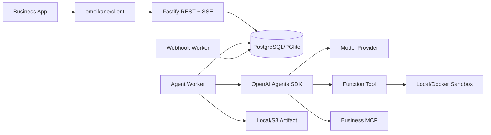

# Omoikane 架构与能力边界

> 当前源码基线：Omoikane `0.0.2`；Node.js 22+；`@openai/agents` `0.17.0`；ESM；migration `0001`

本文是系统架构、能力状态和公共边界的统一事实入口。安装与 API 操作见[开发者手册](DEVELOPER_GUIDE.md)，Provider 细节见[Provider 文档](PROVIDERS.md)，未关闭工作见[生产就绪清单](PRODUCTION_READINESS.md)。

## 1. 定位与职责

Omoikane 是完全使用 TypeScript 实现、通过 npm 和 Docker 分发的独立 Agent Runtime。OpenAI Agents SDK 负责 Agent loop、Tool/MCP、Handoff、Guardrail、结构化输出和模型流；Omoikane 补齐服务化、持久化、Provider 管理、长期状态和平台治理。

稳定调用边界是 REST/SSE 和 `omoikane/client`。业务项目不访问 Runtime 数据库，也不依赖内部 service。

| Omoikane | 业务项目 |
|---|---|
| Provider、Agent Version、Runner、Session、Event | 最终用户身份、权限和 UI |
| Tool/MCP 调度、审批状态、Run 恢复 | 审批人的鉴权和业务决定 |
| Memory、Compaction、Artifact | 业务主数据与业务事务 |
| Usage/Cost、Webhook、Runtime Generation | 调度策略、业务通知和结果解释 |
| Sandbox 生命周期和资源边界 | 决定允许暴露哪些业务能力 |

## 2. 能力矩阵

“已实现”表示存在可执行 TypeScript 和至少一种自动化验证，不表示已经获得生产 SLA。

| 能力 | OpenAI Agents SDK | Omoikane 当前状态 |
|---|---|---|
| Agent 定义与注册 | `Agent` 对象 | `AGENT.md`、全局设置、不可变版本和发布已实现 |
| Runner | `Runner`、`RunState` | 队列、lease、取消、超时和恢复已实现；多进程故障注入待补 |
| Function Tool | `tool()` | 注册表、Schema、审批和执行账本已实现 |
| MCP | stdio/SSE/Streamable HTTP | 注册、Secret 引用和健康检查已实现；细粒度执行策略未强制 |
| Session/Context | Session 接口 | PostgreSQL/PGlite Transcript 与 Projection 已实现 |
| Streaming | SDK stream events | SSE、顺序号、重放、reasoning/output 分流已实现；当前使用 DB polling |
| Guardrail | 输入/输出 Guardrail | 配置式正则规则已实现；不是完整策略引擎 |
| 人工审批 | interruption + RunState | 加密状态、跨 Worker approve/reject/resume 已实现 |
| 结构化输出 | JSON Schema output type | Agent Version 固化 Schema 已实现 |
| 数据库存储 | 不提供平台数据库 | PostgreSQL 生产、PGlite 开发，migration `0001` |
| REST/SSE API | 不提供 | Fastify `/v1` API 和 TypeScript Client 已实现 |
| Tracing/Usage/Cost | SDK tracing 与 Usage | Trace metadata、Usage、价格、成本和基础预算已实现 |
| 多 Agent | Handoff | 版本引用、递归构建和环检测已实现 |
| Sandbox | 不提供业务容器沙箱 | Local/Docker 已实现；Local 不安全，生产策略仍有缺口 |
| `SKILL.md` | 不提供平台技能治理 | Bundle、版本、物化和指令注入已实现 |
| 长期经验记忆 | 不提供 | Scope、CRUD、检索和 Run 后写入已实现；检索质量仍是基础级别 |
| Context Compaction | Provider/SDK 有相关接口 | Portable Projection、审计和恢复已实现；Native adapter 未接入 |
| Artifact | 不提供平台文件服务 | Local/S3、校验和和 Run 血缘已实现 |
| Webhook | 不提供 | 事务内 Delivery、HMAC、重试和重放已实现 |
| Release/Channel | 不提供 | 不可变 Project Release 和 CAS Channel 已实现 |

完整生产缺口只在[生产就绪清单](PRODUCTION_READINESS.md)维护，专题文档不再各自建立重复待办。

## 3. 技术架构

| 层 | 实现 |
|---|---|
| Agent Runtime | `@openai/agents`、`@openai/agents-openai`、AI SDK adapter |
| API | Fastify 5、REST、SSE、multipart |
| 数据 | `pg` + PostgreSQL；本地和测试使用 PGlite |
| Schema/配置 | TypeScript、Zod、JSON Schema、YAML |
| MCP | `@modelcontextprotocol/sdk` |
| Artifact | 本地文件或 S3 API |
| Sandbox | Node `child_process` + Docker CLI |
| 测试 | Vitest + Agents SDK `ScriptedModel` + 显式 live E2E |
| 分发 | 单一 npm 包、CLI bins、Docker/Compose/Helm |



主要模块：

- `Container`：composition root；
- `ProviderService`：Provider/Profile/Model 和 SDK Model adapter；
- `AgentFactory`：把已发布 Agent Version 编译为 SDK `Agent`；
- `RunnerService`：领取 Run，执行 SDK，保存事件、Usage、审批和结果；
- `SessionService`：保存 Canonical Transcript，实现 SDK Session；
- `CompactionService`：生成可逆 Context Projection；
- `ToolService`、`SkillService`、`MemoryService`、`SandboxService`、`ArtifactService`：平台扩展能力；
- `EventStore` 与 `WebhookWorker`：持久事件、Transactional Outbox 和外部通知。

源码集中在 `src/`，迁移为 `migrations/0001_typescript_runtime.sql`，离线测试位于 `test/`，真实 Provider E2E 位于 `test/e2e/`。

## 4. Agent 定义、默认与平台策略

配置分层：

```text
Platform Policy（不可突破）
  ↓
Global Defaults（租户默认）
  ↓
AGENT.md spec（角色覆盖）
  ↓
显式发布 overrides
  ↓
Immutable Agent Version
```

- global instructions：所有角色必须遵守的组织规则；
- defaults：模型设置、Runtime 限额、Memory、Compaction、Tracing 和 Sandbox 默认；
- policy：turns、tool calls、handoffs、运行时长等硬上限；
- `AGENT.md`：角色身份、目标、判断标准及确有必要的差异；
- Provider Connection：独立管理，不在角色中保存 Key、URL 或协议。

最小定义：

```md
---
apiVersion: agentsdk/v1
kind: Agent
metadata:
  slug: research-reviewer
  name: Research Reviewer
spec:
  provider:
    connection_id: <connection-id>
  model: mimo-v2.5
  tools: []
  skills: []
---

Review evidence, unsupported claims and unresolved questions.
```

编译和发布依次执行：校验 Definition、深合并 defaults、应用显式 overrides、前置 global instructions、按 policy 收紧数值限额、固化 revision/config hash、创建 draft，再显式 publish。全局设置变化不会修改旧 Agent Version。

| 内容 | 放置位置 |
|---|---|
| 企业政策、统一输出底线 | global instructions / policy |
| 默认 Memory、Compaction、Tracing | global defaults |
| 角色身份、目标和判断标准 | `AGENT.md` body |
| Tool/Skill/MCP/Handoff 差异 | `AGENT.md` spec |
| Provider Key、URL、协议 | Provider Connection |
| 用户请求和业务对象 | Run input/context |
| 完整对话 | Session Transcript |
| 跨会话事实 | Memory |

Agent 是逻辑资源；Agent Version 是不可变运行资源；Project Release 再把一组 Agent/Skill/MCP 版本固化为可回滚集合。

## 5. Run、状态与数据一致性

```text
queued -> running -> completed
                  -> failed
                  -> cancelled
                  -> waiting_approval -> queued -> running
                  -> waiting_reconciliation
```

Run 固化 `agent_version_id`、config hash、SDK version、Runtime Generation 和 Trace ID。Worker 使用 `FOR UPDATE SKIP LOCKED` 领取并续租；未知副作用结果不能自动重复执行，而是进入人工 reconciliation。

审批中断保存加密 SDK `RunState` 及格式版本。恢复时验证版本并应用决定。升级 SDK 时，新旧 generation Worker 不混合恢复彼此的暂停状态。

关键不变量：

- Run 状态、Run version、终态 Event 和目标 Webhook Delivery 同事务提交；
- Event sequence 单调递增，数据库 Event log 是事实来源；
- Tool execution 由 `run_id + tool_call_id + tool` 派生稳定幂等键；
- Session append 使用事务，Canonical Transcript 不因压缩删除；
- Provider Key、Webhook Secret 和 RunState 使用认证加密，API 返回明确剔除密文字段。

## 6. Memory、Compaction、Artifact 与 Sandbox

Memory 和 Compaction 严格分离：Memory 管理跨 Session 的事实及作用域；Compaction 只改变模型输入 Projection，不删除 Transcript，也不自动写 Memory。详细算法见[Context Compaction 文档](CONTEXT_COMPACTION.md)。

Artifact 保存 SHA-256、大小、MIME、storage key、Run 血缘；开发使用本地文件，生产使用 S3/MinIO。

Local Sandbox 只有工作目录和超时，不构成安全边界。生产 Docker Sandbox 使用非 root、只读 rootfs、drop capabilities、`no-new-privileges`、PID/CPU/内存限制、默认无网络和独立可写目录。Docker socket 本身仍是高权限边界，因此 Worker 应独立部署。

## 7. 多项目接入与发布

推荐每个业务环境使用独立 Runtime，或至少隔离数据库、Artifact prefix、Sandbox root 和 Provider Secret：

```text
project-a/dev  -> Omoikane dev A
project-a/prod -> Omoikane prod A
project-b/dev  -> Omoikane dev B
```

共享实例必须位于可信 Gateway 后，由 Gateway 设置 `X-Tenant-ID` 和 `X-Actor-ID`。Runtime 当前不验证 Header 来源，不能直接暴露给互不信任的调用方。

业务定义仓库推荐包含：

```text
business-project/
├── omoikane.yaml
├── agents/*/AGENT.md
├── skills/*/SKILL.md
├── mcp/*.yaml
├── schemas/*.json
├── tests/
└── application/
```

发布顺序为：创建并验证 Provider Connection；上传 Skill/MCP/Agent；发布不可变 Agent Version；创建 Project Release；使用 revision CAS 切换 Channel。回滚只把 Channel 指回历史 Release。

开发中的 Runtime 分为 `local`、`next` 和 `stable`。业务项目依赖固定 Client 版本并连接稳定 Runtime URL，不引用本地源码路径，也不在生产使用 `latest`。

Runtime Generation 用于 SDK/RunState 升级隔离：新 Run 进入新 generation，旧 Worker 排空旧 Run 和审批状态后再停止；数据库迁移遵循 expand/contract。

## 8. 公共合同与部署

npm exports：

- `omoikane`：Runtime、Container、配置、Tool 注册和 Provider Catalog；
- `omoikane/client`：轻量 HTTP/SSE Client；
- bins：`omoikane`、`omoikane-runtime`、`omoikane-worker`、`omoikane-webhook-worker`、`omoikane-migrate`。

生产把 API、Agent Worker 和 Webhook Worker 分开扩缩容，以 PostgreSQL 为事实来源，S3/MinIO 保存 Artifact，并将 Secret、Docker socket 和网络策略放在基础设施边界内。

公共兼容维度包括 REST major、Event schema、Agent Definition、Compaction checkpoint、RunState format、migration head、Runtime Generation 和 Agents SDK version。

## 9. 明确边界

- Runtime 面向受信业务 Agent 平台，不实现最终用户登录、组织和 RBAC；
- 不承诺对任意 Prompt、Trace 和 Tool 参数做可靠的通用脱敏；明确 Secret 使用字段隔离和加密，业务内容由调用方治理；
- 不把 Memory Flush 与 Context Compaction 绑定；
- Agent Version 不保存明文 Provider Key 或任意 URL；只有显式 custom provider 可配置 URL；
- 不把“功能存在”描述成“生产完备”。生产宣布前必须关闭[生产就绪清单](PRODUCTION_READINESS.md)中的 P0 项并完成安全、备份恢复和故障注入审查。
